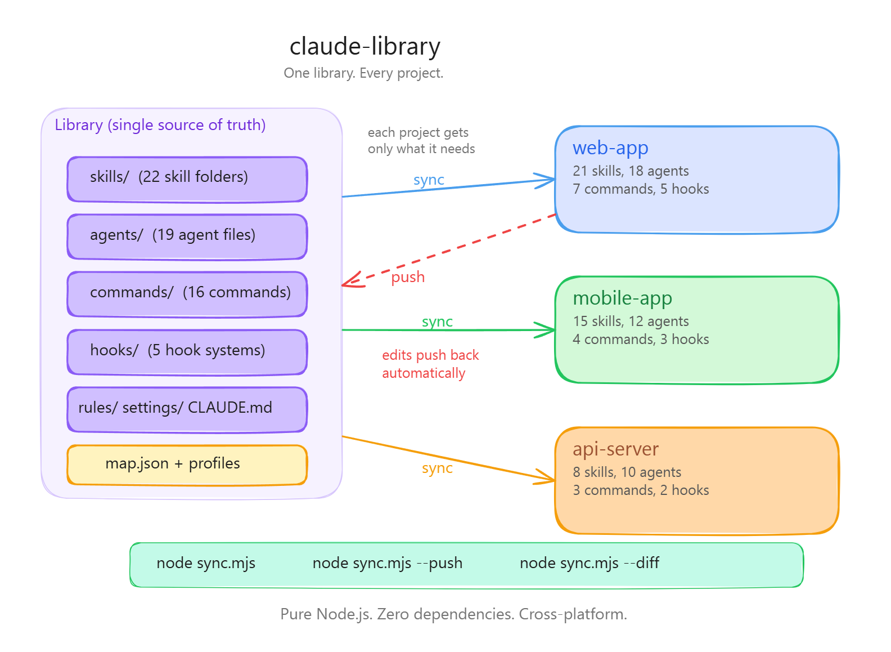
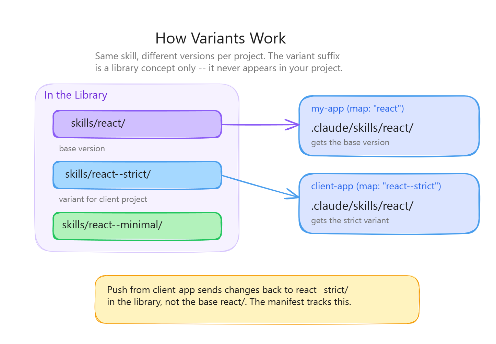

# Bazar

[English](README.md) | Italiano

Se usi Claude Code su più progetti, probabilmente copi le stesse skill, gli stessi agenti e le stesse impostazioni dall'uno all'altro. Quando migliori una skill in un progetto, gli altri restano indietro. Quando avvii un nuovo progetto, ricostruisci a mano la cartella `.claude/` andando a memoria.

Bazar risolve questo problema. Un solo repo contiene tutto. Ogni progetto sceglie ciò che gli serve. Le modifiche viaggiano in entrambe le direzioni. L'intero sistema si controlla in linguaggio naturale con il comando `/bazar`.

<p align="center"><a href="diagrams/variants.png"></a></p>

Questo repository è il **template**: contiene il motore (`sync.mjs`, l'hook di auto-sync `BazarHook`, il comando `/bazar`) e le cartelle delle categorie vuote. Il tuo bazar è un repo privato creato da questo template: contiene i tuoi contenuti e riceve gli aggiornamenti del motore con `--upgrade`.

## Requisiti

- [Node.js](https://nodejs.org/) 18 o superiore
- [Git](https://git-scm.com/)
- [Claude Code](https://docs.anthropic.com/en/docs/claude-code)
- [GitHub CLI](https://cli.github.com/), autenticata con `gh auth login` (serve solo per creare il repo del tuo bazar)

Funziona su Windows, macOS e Linux.

## Come iniziare

### Opzione A: lascia che lo configuri Claude (consigliata)

1. Scarica il file del comando [`bazar.md`](commands/bazar.md)
2. Mettilo in `.claude/commands/bazar.md` in un progetto qualsiasi
3. Apri Claude Code in quel progetto e scrivi:

```
/bazar configura il mio bazar personale
```

Claude creerà il tuo repo privato da questo template, importerà il contenuto attuale della tua cartella `.claude/`, installerà l'hook di auto-sync e collegherà tutto.

### Opzione B: configurazione manuale

```bash
# 1. Crea il tuo bazar privato da questo template
gh repo create my-bazar --template ichelema/bazar --private --clone

# 2a. Un progetto nuovo, partendo dal profilo "starter" (/bazar + hook di auto-sync)
node my-bazar/sync.mjs --init --profile starter --project ./my-project

# 2b. OPPURE un progetto esistente di cui vuoi importare il contenuto di .claude/
node my-bazar/sync.mjs --seed --name "CLAUDE--my-project" --project ./my-project
node my-bazar/sync.mjs --add commands bazar --project ./my-project
node my-bazar/sync.mjs --add hooks BazarHook --project ./my-project
cd my-bazar && git add -A && git commit -m "seed my-project" && git push && cd ..
```

Poi committa la cartella `.claude/` e il `.gitignore` nel repo del progetto. Da qui in avanti usa `/bazar` dentro il progetto.

Il bazar registra da solo il proprio percorso locale su ogni macchina la prima volta che lanci un qualsiasi comando di `sync.mjs` (`node sync.mjs --link` lo fa in modo esplicito).

## Usare /bazar

Una volta configurato, `/bazar` è la tua unica interfaccia. Basta parlare:

```
/bazar sincronizza                               --> Scarica l'ultima versione dal bazar
/bazar cosa non è allineato?                     --> Mostra la tabella delle differenze
/bazar pubblica le mie modifiche                 --> Push con conferma
/bazar aggiungi la skill payment-processing      --> Aggiungi a questo progetto
/bazar rimuovi la skill archon                   --> Rimuovi solo da questo progetto
/bazar ho creato una nuova skill, aggiungila     --> Crea un nuovo elemento del bazar
/bazar crea una variante di react                --> Versione specifica per il progetto
/bazar configura my-new-repo                     --> Collega un altro progetto
/bazar crea un profilo chiamato minimal          --> Selezione di elementi riutilizzabile
/bazar aggiungi react al profilo dev             --> Aggiorna un profilo
/bazar aggiungi CLAUDE_GPT.md a tutti i progetti --> Aggiunge a "defaults" (tutti i progetti)
/bazar l'auto-sync funziona?                     --> Controlla lo stato di BazarHook
/bazar aggiorna il motore                        --> Aggiorna il motore dal template
/bazar mostra tutto                              --> Inventario completo
```

`/bazar` funziona anche quando Claude Code è aperto dentro il repo del bazar stesso (grazie a `.claude/commands/bazar.md`, che carica `commands/bazar.md`). Lì devi indicare il progetto su cui agire, per esempio `/bazar importa la skill nome-skill in my-bazar da D:/AI/my-project`.

## Cosa gestisce

Ogni categoria è salvata in una propria cartella del bazar e viene installata in un punto fisso del progetto. Skill e hook sono **cartelle intere** (tutti i file e le sottocartelle); agents, commands e rules sono **singoli file `.md`**. Agents e commands possono essere anche una **cartella di file `.md`** (un gruppo, sincronizzato come un solo elemento).

| Categoria       | Nel bazar                 | Installato in                | Unità    |
| --------------- | ------------------------- | ---------------------------- | -------- |
| **Skills**      | `skills/{name}/`          | `.claude/skills/{name}/`     | cartella |
| **Hooks**       | `hooks/{name}/`           | `.claude/hooks/{name}/`      | cartella |
| **Agents**      | `agents/{name}.md`        | `.claude/agents/{name}.md`   | file     |
| **Commands**    | `commands/{name}.md`      | `.claude/commands/{name}.md` | file     |
| **Rules**       | `rules/{name}.md`         | `.claude/rules/{name}.md`    | file     |
| **CLAUDE.md**   | `claude-mds/{name}.md`    | `CLAUDE.md`                  | file     |
| **Settings**    | `settings/{name}.json`    | `.claude/settings.json`      | file     |
| **MCP configs** | `mcp-configs/{name}.json` | `.mcp.json`                  | file     |
| **Files**       | `files/{name}`            | qualsiasi percorso scelto    | file     |

Un gruppo come `commands/ui-craft/` (che contiene `adapt.md`, `audit.md`, ...) si mappa con un solo nome, `"commands": ["ui-craft"]`, e viene installato in `.claude/commands/ui-craft/`: Claude Code chiama quei comandi `/ui-craft:adapt`, `/ui-craft:audit`. I gruppi di agenti funzionano allo stesso modo (il nome di un agente viene dal campo `name` nel suo file). Bazar distingue le due forme da cosa esiste nel bazar: una cartella `ui-craft/` o un file `ui-craft.md`; se esistono entrambi l'elemento viene saltato con un avviso. Le skill non si possono raggruppare: Claude Code le trova solo in `.claude/skills/{name}/SKILL.md`.

Una skill come `git-commits` viene sincronizzata per intero, compreso per esempio `references/test.md`; non puoi tracciare un singolo file al suo interno. Per escludere parti di un elemento di tipo cartella usa `ignore` in `map.json` (vedi sotto). `logs/`, `node_modules/`, `*.log`, `.DS_Store`, `Thumbs.db` e i file di stato degli hook sono sempre esclusi.

**Files** sono qualsiasi altro file singolo, messo dove dici tu. Esempio: mettere `test.txt` nella radice di un progetto.

```bash
cp test.txt my-bazar/files/test.txt
cd my-bazar && git add files/test.txt && git commit -m "add files/test.txt" && git push
node sync.mjs --add files test.txt test.txt --project ../my-project   # nome nel bazar, poi percorso nel progetto
```

## Come funziona la sincronizzazione

Il **sync** porta il contenuto dal bazar nel progetto. Il **push** rimanda al bazar le tue modifiche locali.

```
Bazar ----sync----> Progetto     (il bazar sovrascrive il progetto)
Bazar <---push----- Progetto     (il progetto sovrascrive il bazar)
Bazar <---diff----> Progetto     (solo confronto, nessuna modifica)
```

- **Il push è additivo.** Aggiunge e aggiorna file, ma non cancella mai un file del bazar solo perché manca su questa macchina. Usa `--push --prune` solo per rendere il bazar identico a questa macchina (cancellazioni o rinomine volute).
- **I conflitti vengono rilevati, non sovrascritti.** Ogni macchina ricorda lo stato concordato al suo ultimo sync. Un push segnala e salta:
  - `CONFLICT`: l'elemento è cambiato sia nel bazar sia in questo progetto. Fai un sync per prendere la versione del bazar, oppure fai il push di quell'elemento con `--force` per tenere la tua.
  - `STALE`: il bazar è andato avanti e qui non è cambiato nulla. Un sync semplice aggiorna il progetto.
  - `NO BASE`: l'elemento esiste nel bazar ma questa macchina non l'ha mai sincronizzato. Fai prima un sync.
- **I fine riga non contano come modifiche.** Un file salvato di nuovo con CRLF invece di LF resta allineato.
- **Git è automatico.** Sync, diff e push scaricano prima il bazar (pull). Il push committa e pubblica. I comandi che modificano `map.json` (`sync`, `--add`, `--remove`, `--init`, `--seed`) lo committano e pubblicano subito. Se un push fallisce (per esempio offline), il commit resta in locale, il comando segnala `Git error` e la volta successiva lo pubblica.

## Riferimento comandi

Si possono lanciare da qualsiasi cartella; `--project <path>` sceglie il progetto (predefinito: la cartella corrente).

| Comando | Cosa fa |
| --- | --- |
| `node sync.mjs` | Sync bazar -> progetto |
| `node sync.mjs --all` | Sincronizza tutti i progetti presenti su questa macchina |
| `node sync.mjs --diff` | Confronta progetto e bazar (`=` allineato, `*` modificato, `!` mancante) |
| `node sync.mjs --push [-y]` | Push degli elementi modificati (chiede conferma se manca `-y`) |
| `node sync.mjs --push --category skills --item react` | Push di un singolo elemento (o di un'intera categoria senza `--item`) |
| `node sync.mjs --push --prune` | Push e cancellazione dei file del bazar assenti su questa macchina |
| `node sync.mjs --push --category <cat> --item <name> --force` | Sovrascrive il bazar con la versione di questa macchina (risoluzione dei conflitti) |
| `node sync.mjs --add <cat> <name>` | Aggiunge un elemento al progetto (`skills`, `agents`, `commands`, `hooks`, `rules`) |
| `node sync.mjs --add files <name> <path>` | Aggiunge un file di `files/` nel percorso `<path>` del progetto |
| `node sync.mjs --remove <cat> <name>` | Rimuove un elemento dal progetto (resta nel bazar) |
| `node sync.mjs --init --profile <name> [--name <key>]` | Registra un nuovo progetto partendo da un profilo |
| `node sync.mjs --init --from <project> [--name <key>]` | Registra un nuovo progetto copiando la selezione di un altro progetto |
| `node sync.mjs --seed [--name <slug>]` | Importa il contenuto di `.claude/` di un progetto esistente |
| `node sync.mjs --list` | Mostra elementi, profili e progetti |
| `node sync.mjs --upgrade [-y]` | Aggiorna i file del motore dal template |
| `node sync.mjs --link` / `--unlink` | Registra / rimuove il percorso di questo bazar su questa macchina |

## Importare un progetto esistente (seed)

`--seed` importa skill, agenti, comandi e hook di un progetto e, con `--name <slug>`, anche il suo `CLAUDE.md`, `settings.json` e `.mcp.json`. Non sovrascrive mai un elemento che altri progetti potrebbero usare:

- **Nome libero**: importato con il proprio nome.
- **Stesso nome, contenuto identico**: solo collegato, non viene copiato nulla.
- **Stesso nome, contenuto diverso**: importato come variante `{name}--{project-key}`, che viene installata come `{name}` solo in questo progetto.
- **Elementi del motore** (`BazarHook`, `/bazar`): mai importati; il progetto riceve la versione del bazar.
- **File di configurazione il cui nome è già usato da un altro progetto**: importato come `{slug}-xxxx`.

Il seed committa solo `map.json`: gli elementi importati vanno committati a mano nel bazar. I file di `rules/` non vengono importati.

## Rimuovere elementi

- **Da un solo progetto**: `node sync.mjs --remove skills react --project <path>`. L'elemento viene cancellato dal progetto e dalla sua voce in `map.json`; resta nel bazar.
- **Dal bazar e da tutti i progetti**: togli il nome da ogni progetto e profilo in `map.json`, cancella la cartella o il file (e le sue copie `--variante`) dal bazar, togli la sua voce da `master-skill-rules.json` se presente, poi committa e pubblica. Ogni progetto cancella la sua copia al sync successivo.

Non cancellare a mano un elemento gestito dentro un progetto: il sync successivo lo rimette.

## Varianti

Lo stesso elemento può avere versioni diverse per progetti diversi. Le varianti usano la convenzione `name--suffix` nel bazar, ma vengono installate con il nome base.

<p align="center"><a href="diagrams/hero-architecture.png"></a></p>

| Nel bazar               | Installato come         | Chi lo riceve                            |
| ----------------------- | ----------------------- | ---------------------------------------- |
| `skills/react/`         | `.claude/skills/react/` | I progetti che mappano `"react"`         |
| `skills/react--strict/` | `.claude/skills/react/` | I progetti che mappano `"react--strict"` |
| `CLAUDE--web-app.md`    | `CLAUDE.md`             | Il progetto web-app                      |

Il suffisso della variante non compare mai nel progetto, e il push rimanda le modifiche alla variante giusta. Un progetto usa una sola variante per elemento: `--add skills react--strict` su un progetto che mappa `react` lo fa passare a `react--strict`.

## Profili e map.json

`map.json` descrive cosa riceve ogni progetto. I profili sono selezioni riutilizzabili, applicate con `--init --profile`: vengono copiati una volta sola, quindi le modifiche successive al profilo non arrivano ai progetti esistenti. `defaults` vale per **tutti** i progetti a ogni sync.

```json
{
  "template": "https://github.com/ichelema/bazar.git",
  "ignore": {
    "BazarHook": ["logs", "pending-sync.json"],
    "git-commits": ["references"]
  },
  "defaults": {
    "files": { "CLAUDE_GPT.md": "CLAUDE_GPT.md" }
  },
  "profiles": {
    "dev": {
      "skills": ["react", "git-commits", "auth"],
      "agents": ["backend-engineer"],
      "commands": ["bazar", "build"],
      "hooks": ["BazarHook", "FormatterHook"],
      "rules": ["repo-primer--dev"],
      "claude-md": "CLAUDE--dev",
      "settings": "settings--dev",
      "mcp": "mcp--win",
      "files": { "justfile": "justfile" },
      "gitignore-lines": [".claude/hooks/BazarHook/pending-sync.json"]
    }
  },
  "projects": {
    "my-project": {
      "skills": ["react"],
      "commands": ["bazar"],
      "hooks": ["BazarHook"],
      "paths": { "MY-PC": ["D:/AI/my-project"], "my-laptop": ["/home/me/my-project"] }
    }
  }
}
```

- `template`: da dove `--upgrade` scarica il motore.
- `ignore`: per ogni elemento, le parti di percorso escluse da sync, diff e push.
- `defaults`: stessa forma di un progetto, unita a ogni progetto a ogni sync (la voce del progetto vince sullo stesso elemento, file o impostazione). Per togliere un elemento di default, toglilo da `defaults`: sparisce da tutti i progetti.
- `gitignore-lines`: righe aggiunte al `.gitignore` del progetto durante il sync.
- `projects.<key>.paths`: gestito automaticamente, per macchina.

## Auto-sync

`BazarHook` mantiene allineati progetto e bazar senza push manuali.

- **Stop** (`bazar-sync.mjs`): parte alla fine di ogni turno di Claude. Un controllo veloce delle date di modifica dei file gestiti rileva le modifiche locali (fatte da Claude, da un editor o dal terminale) e le pubblica.
- **SessionStart** (`bazar-session-start.mjs`): parte all'avvio e alla ripresa della sessione. Prima pubblica le modifiche locali in sospeso, poi sincronizza bazar -> progetto. Se il push viene rifiutato, il sync viene saltato, così le modifiche locali non vengono mai sovrascritte.

Entrambi i push automatici sono additivi. Ogni sync mantiene registrate le due voci dell'hook nel `settings.json` del progetto, anche quando quel file è gestito dal bazar. I log sono in `.claude/hooks/BazarHook/logs/bazar-sync.log`.

Per spegnere l'auto-sync rimuovi l'elemento hook (`/bazar disattiva l'auto-sync`, oppure `--remove hooks BazarHook` più la cancellazione delle voci `Stop`/`SessionStart` da `settings.json`).

## Più macchine

- **I progetti si riconoscono dalla chiave, non dal percorso.** La chiave è il nome della cartella per impostazione predefinita (oppure `--init --name <key>`); se un altro progetto la usa già, viene aggiunto una volta un breve suffisso (`api-7f3a`). La chiave è salvata in `.claude/bazar.json` del progetto, quindi lo stesso repo clonato in qualsiasi punto, su Windows o su Linux, corrisponde alla stessa voce. Se quella chiave manca da `map.json`, il sync si ferma con un errore invece di tirare a indovinare.
- **Il percorso del bazar è per macchina**, salvato in `~/.claude/bazar-paths.json`. La variabile d'ambiente `CLAUDE_BAZAR_PATH` ha la precedenza.
- **`--all` è per macchina.** Sincronizza solo i percorsi di questa macchina il cui manifest indica quel progetto, e scarta i percorsi non più validi.

## Cosa committare nei tuoi progetti

Committa `.claude/` (compreso `.claude/bazar.json`) e `.gitignore`. Il sync tiene fuori da git in automatico:

- `.claude/bazar.state.json`: lo stato di sincronizzazione di questa macchina
- `.claude/hooks/BazarHook/logs/` e `pending-sync.json`: file di lavoro dell'hook

`.claude/bazar.json` contiene solo la chiave del progetto, il remote del bazar e gli elementi gestiti, quindi cambia solo quando cambia l'elenco degli elementi.

## Aggiornare il motore

Un bazar creato da questo template non ne condivide la storia git, quindi le correzioni del motore non arrivano da sole. Lancia:

```bash
node sync.mjs --upgrade
```

Scarica il template indicato in `map.json` (`"template"`), mostra quali file del motore sono cambiati (`sync.mjs`, `lib/`, `hooks/BazarHook/`, `commands/bazar.md`, `.claude/commands/bazar.md`, `.gitattributes`) e, dopo la conferma, li committa e li pubblica. Le tue skill, i tuoi agenti, `map.json`, i settings e il README non vengono mai toccati. I progetti ricevono il nuovo hook e il nuovo comando al sync successivo.

## Struttura del repository

```
your-bazar/
├── sync.mjs                  # Motore CLI (Node.js puro, nessuna dipendenza)
├── map.json                  # URL del template, pattern ignore, profili, progetti
├── lib/                      # Moduli di supporto usati da sync.mjs
├── skills/                   # Cartelle delle skill (SKILL.md + file di supporto)
├── agents/                   # Definizioni degli agenti (file .md o cartelle di gruppo)
├── commands/                 # Slash command (file .md o cartelle di gruppo)
│   └── bazar.md              # Il comando /bazar (installato nei progetti)
├── hooks/                    # Cartelle degli hook
│   └── BazarHook/            # Hook di auto-sync
├── rules/                    # File delle regole (.md)
├── claude-mds/               # File CLAUDE.md (uno per progetto/profilo)
├── settings/                 # File settings.json (uno per progetto/profilo)
├── mcp-configs/              # File .mcp.json (per progetto/piattaforma)
├── files/                    # File singoli con percorso di installazione scelto
├── master-skill-rules.json   # Regole di attivazione delle skill (filtrate per progetto)
├── .claude/commands/bazar.md # Rende disponibile /bazar dentro il repo del bazar
└── .gitattributes            # Salva i file di testo con LF nel repo
```

## Crediti

Derivato da [claude-fast-library](https://github.com/Abdo-El-Mobayad/claude-fast-library) di Abdo El Mobayad, parte di [Claude Fast](https://claudefa.st) -- un sistema di gestione dello sviluppo con AI per Claude Code.
